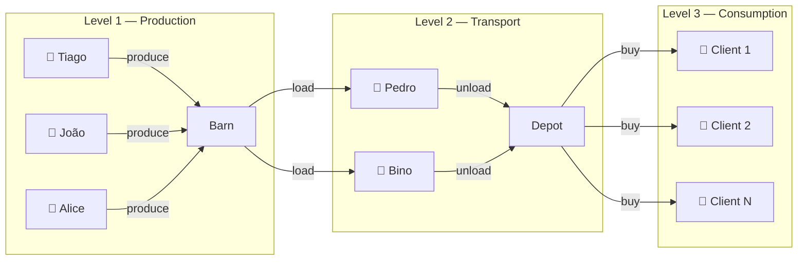
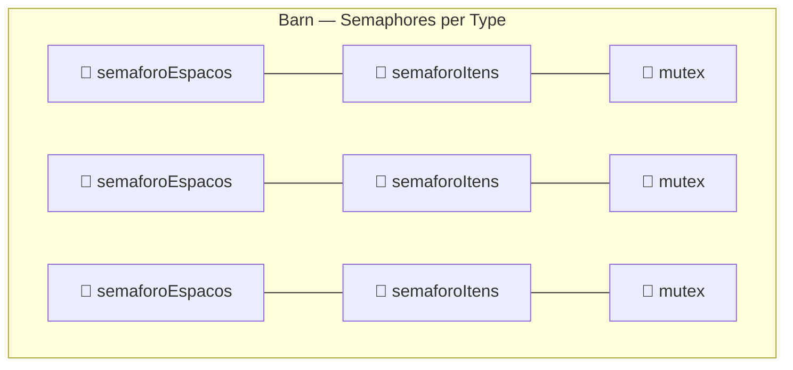

<div align="center">

# 🍉 Concurrent Fruit Supply Chain Simulation
### Simulação de Cadeia de Produção de Frutas

<p>
    <a href="#-english">🇺🇸 English</a> &nbsp;&nbsp;&nbsp;|&nbsp;&nbsp;&nbsp; <a href="#-português">🇧🇷 Português</a>
</p>

<p>
    
    
    
    
</p>

</div>

---

<div id="-english"></div>

# 🇺🇸 English

## 📖 About the Project

**Concurrent Fruit Supply Chain Simulation** is a complete C++11 multi-threaded application simulating a fruit production, transport, and sales pipeline. This project demonstrates advanced **Operating Systems** concepts, including concurrent programming with multiple threads, synchronization via **custom counting semaphores**, **deadlock prevention**, and a multi-level **Producer-Consumer** problem.

The system operates with **10+ simultaneous threads** coordinated by fine-grained semaphores — one for **each resource type** — rather than a global semaphore, ensuring maximum parallelism and avoiding unnecessary blocking.

---

## 🏗️ System Architecture

```
┌─────────────┐     ┌──────────────┐     ┌─────────────────┐     ┌──────────────┐     ┌─────────────┐
│   FARMERS   │     │     BARN     │     │   TRANSPORTERS  │     │    DEPOT     │     │  CUSTOMERS  │
│  (Threads)  │────▶│  (Buffer 1)  │────▶│    (Threads)    │────▶│  (Buffer 2)  │────▶│  (Threads)  │
│             │     │              │     │                 │     │              │     │             │
│ Tiago  🍉  │     │ Cap: 50      │     │ Pedro 🚛       │     │ Cap: 100     │     │ Client-1    │
│ João   🍇  │     │ Sem/type: 3  │     │ Bino  🚛       │     │ Sem/type: 3  │     │ Client-2    │
│ Alice  🍓  │     │ Mutex/type:3 │     │ Truck w/ 10    │     │ Mutex/type:3 │     │ Client-N    │
└─────────────┘     └──────────────┘     └─────────────────┘     └──────────────┘     └─────────────┘
```

### 3-Level Pipeline (Producer-Consumer)



---

## 🔬 Synchronization Model

The key feature of this project is **fine-grained synchronization**. Each shared resource (Barn, Depot, Truck) has **independent semaphores and mutexes per fruit type**:



| Mechanism | Quantity | Purpose |
|-----------|-----------|------------|
| `Semaforo` (custom) | 18 instances | Space and item control per fruit type in each buffer |
| `std::mutex` | 12 instances | Mutual exclusion per fruit type + global mutexes |
| `std::atomic<>` | 5 variables | Thread-safe dynamic configuration |
| `std::thread` | 10+ threads | Farmers, transporters, and clients |
| `std::condition_variable` | 18 (internal) | Blocking/signaling inside the Semaphore |

### Why Separate Semaphores per Type?

With a **single global semaphore**, if the barn has 10 watermelons but 0 grapes, a transporter looking for grapes would **block indefinitely** even though there are fruits available. With separate semaphores, each type operates independently — no unnecessary blocking and no risk of deadlock.

---

## 📁 Project Structure

```
.
├── main.cpp              # Entry point and interactive menu
├── Configuracao.h/cpp    # Global parameters with std::atomic
├── Semaforo.h            # Custom counting semaphore (C++11)
├── Fruta.h               # FruitType Enum and utilities
├── Celeiro.h/cpp         # Production buffer with per-type semaphores
├── Caminhao.h/cpp        # Transport vehicle with per-type semaphores
├── Deposito.h/cpp        # Sales buffer with per-type semaphores
├── Fazendeiro.h/cpp      # Producer thread
├── Transportador.h/cpp   # Intermediate thread (consumer + producer)
├── Cliente.h/cpp         # Consumer thread
├── Makefile              # Build for Linux/macOS
├── compilar.bat          # Build for Windows
├── docs/                 # Documentation files
└── .gitignore
```

---

## ⚡ Build and Run

### Prerequisites

- **C++ Compiler** with C++11 support (GCC 4.8+, Clang 3.3+, MSVC 2015+)
- **pthread** (included in Linux/macOS; MinGW in Windows)

### Linux / macOS

```bash
make
./sistema_frutas
```

### Windows

```bash
# Option 1: Double-click compilar.bat
# Option 2: Via terminal
g++ -std=c++11 -Wall -Wextra -pthread -O2 -o sistema_frutas.exe *.cpp
sistema_frutas.exe
```

### Makefile Commands

| Command | Description |
|---------|-----------|
| `make` | Compiles the project |
| `make run` | Compiles and runs |
| `make clean` | Removes binaries |
| `make rebuild` | Cleans and recompiles |

---

## 🎮 System Usage

### Initial Configuration

Upon starting, the system allows interactive configuration:

| Parameter | Default | Description |
|-----------|--------|-----------|
| Barn Capacity | 50 | Total storage slots |
| Truck Capacity | 10 | Items per trip |
| Depot Capacity | 100 | Total market slots |
| Client Count | 5 | Consumer threads |
| Production Time | 2000ms | Interval between productions |
| Transport Time | 3000ms | Trip duration |
| Buying Time | 1000ms | Payment duration |
| Chores Time | 2000ms | Interval between purchases |

### Real-Time Commands

```
> help          Display command menu
> status        Show current buffer states
> tempo         Dynamically change execution times
> sair          Gracefully terminate all threads
```

### Example Output

```
16:42:31.245 | [FAZENDEIRO] Tiago produced Melancia
16:42:31.246 | [CELEIRO] Tiago stored Melancia (Stock Melancia: 5, Total: 12)
16:42:32.100 | [TRANSPORTADOR] Pedro started loading truck
16:42:32.101 | [CELEIRO] Pedro removed Melancia (Stock Melancia: 4, Total: 11)
16:42:32.102 | [CAMINHAO-Pedro] Loaded Melancia (Load Melancia: 1, Total: 1)
16:42:35.200 | [TRANSPORTADOR] Pedro arrived at Kategatt and started unloading
16:42:35.201 | [DEPOSITO] Pedro stored Melancia (Stock Melancia: 8, Total: 23)
16:42:37.500 | [CLIENTE] Cliente-1 wants to buy Morango
16:42:37.501 | [DEPOSITO] Cliente-1 bought Morango (Stock Morango: 3, Total: 22)
```

---

## 🧪 Test Scenarios

| Scenario | Configuration | Expected Behavior |
|---------|-------------|----------------------|
| **Slow Production** | Prod: 5000ms, Trans: 1000ms | Depot empties, clients block waiting for fruit |
| **Slow Transport** | Prod: 500ms, Trans: 10000ms | Barn fills up, farmers block on space semaphore |
| **High Demand** | 20 clients, Chores: 500ms | Consumption exceeds supply, depot tends to zero |
| **Balanced** | Default values | Continuous flow without significant bottlenecks |

---

## 🎓 OS Concepts Demonstrated

- **Concurrent Programming** — 10+ threads executing simultaneously
- **Producer-Consumer Problem** — 3-level pipeline with bounded buffers
- **Counting Semaphores** — custom implementation with `mutex` + `condition_variable`
- **Mutual Exclusion (Mutex)** — granular protection of critical sections
- **Atomic Variables** — lock-free real-time configuration updates
- **Deadlock Prevention** — independent semaphores per resource eliminate circular dependencies
- **Graceful Shutdown** — atomic flag + `thread::join()` for coordinated shutdown

---

<div id="-português"></div>

# 🇧🇷 Português

## 📖 Sobre o Projeto

Sistema de simulação de uma **cadeia de produção, transporte e venda de frutas** implementado em C++11. O projeto demonstra conceitos avançados de **Sistemas Operacionais**, incluindo programação concorrente com múltiplas threads, sincronização via **semáforos contáveis customizados**, prevenção de **deadlock**, e o clássico problema **Produtor-Consumidor** em múltiplos níveis.

O sistema opera com **10+ threads simultâneas** coordenadas por semáforos de granularidade fina — um para **cada tipo de recurso** — ao invés de um semáforo global, garantindo máximo paralelismo e evitando bloqueios desnecessários.

---

## 🏗️ Arquitetura do Sistema

```
┌─────────────┐     ┌──────────────┐     ┌─────────────────┐     ┌──────────────┐     ┌─────────────┐
│ FAZENDEIROS │     │   CELEIRO    │     │ TRANSPORTADORES │     │   DEPÓSITO   │     │  CLIENTES   │
│  (Threads)  │────▶│  (Buffer 1)  │────▶│   (Threads)     │────▶│  (Buffer 2)  │────▶│  (Threads)  │
│             │     │              │     │                 │     │              │     │             │
│ Tiago  🍉  │     │ Cap: 50      │     │ Pedro 🚛       │     │ Cap: 100     │     │ Cliente-1   │
│ João   🍇  │     │ Sem/tipo: 3  │     │ Bino  🚛       │     │ Sem/tipo: 3  │     │ Cliente-2   │
│ Alice  🍓  │     │ Mutex/tipo:3 │     │ Caminhão c/ 10 │     │ Mutex/tipo:3 │     │ Cliente-N   │
└─────────────┘     └──────────────┘     └─────────────────┘     └──────────────┘     └─────────────┘
```

### Pipeline de 3 Níveis (Produtor-Consumidor)

O processo flui do Nível 1 (Produção) para o Nível 2 (Transporte) e finalmente para o Nível 3 (Consumo), com buffers intermediários controlados por semáforos.

---

## 🔬 Modelo de Sincronização

O diferencial deste projeto é a **granularidade fina** na sincronização. Cada recurso compartilhado (Celeiro, Depósito, Caminhão) possui **semáforos e mutexes independentes por tipo de fruta**:

| Mecanismo | Quantidade | Finalidade |
|-----------|-----------|------------|
| `Semaforo` (customizado) | 18 instâncias | Controle de espaços e itens por tipo de fruta em cada buffer |
| `std::mutex` | 12 instâncias | Exclusão mútua por tipo de fruta + mutexes globais |
| `std::atomic<>` | 5 variáveis | Configurações dinâmicas thread-safe |
| `std::thread` | 10+ threads | Fazendeiros, transportadores e clientes |
| `std::condition_variable` | 18 (interno) | Bloqueio/sinalização dentro do Semáforo |

### Por que Semáforos Separados por Tipo?

Com um **semáforo único**, se o celeiro tiver 10 melancias mas 0 uvas, um transportador buscando uvas **bloquearia indefinidamente** mesmo com frutas disponíveis. Com semáforos separados, cada tipo opera de forma independente — sem bloqueios desnecessários e sem risco de deadlock.

---

## ⚡ Compilação e Execução

### Pré-requisitos

- **Compilador C++** com suporte a C++11 (GCC 4.8+, Clang 3.3+, MSVC 2015+)
- **pthread** (incluído em Linux/macOS; MinGW no Windows)

### Linux / macOS

```bash
make
./sistema_frutas
```

### Windows

```bash
# Opção 1: Duplo-clique em compilar.bat
# Opção 2: Via terminal
g++ -std=c++11 -Wall -Wextra -pthread -O2 -o sistema_frutas.exe *.cpp
sistema_frutas.exe
```

---

## 🎮 Uso do Sistema


Ao iniciar, o sistema permite configurar interativamente as capacidades e tempos de execução.

### Comandos em Tempo Real

```
> help          Exibe menu de comandos
> status        Mostra o estado atual dos buffers
> tempo         Altera tempos de execução dinamicamente
> sair          Encerra todas as threads graciosamente
```

---

## 🎓 Conceitos de Sistemas Operacionais Demonstrados

- **Programação Concorrente** — 10+ threads executando simultaneamente
- **Problema Produtor-Consumidor** — em 3 níveis com buffers limitados
- **Semáforos Contáveis** — implementação customizada com `mutex` + `condition_variable`
- **Exclusão Mútua (Mutex)** — proteção granular de seções críticas
- **Variáveis Atômicas** — configurações modificáveis em tempo real sem locks
- **Prevenção de Deadlock** — semáforos independentes por recurso eliminam dependências circulares
- **Encerramento Gracioso** — flag atômica + `thread::join()` para shutdown coordenado

---

## 📄 License / Licença

Acamedic project developed for the Operating Systems course. Educational use permitted.
Projeto acadêmico desenvolvido para a disciplina de Sistemas Operacionais. Uso educacional permitido.

